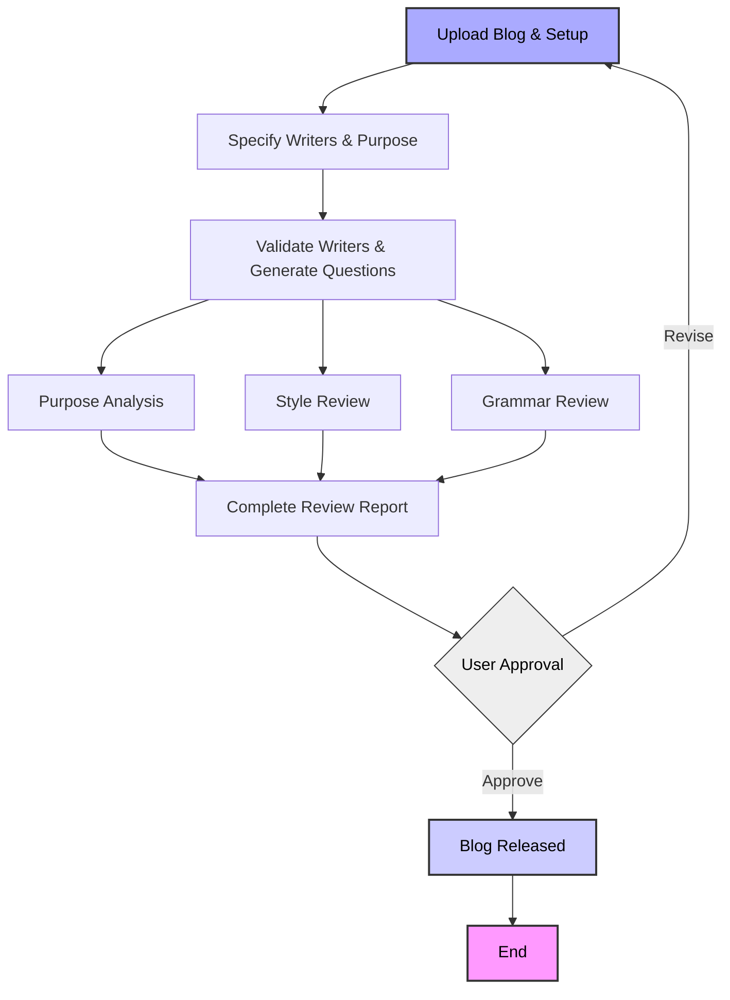

# Product Requirements Document: AI Blog Reviewer

## 1. App Overview

**Goal:**
Accelerate the high-quality development of thoughtful blog content by automating the review processes. Human authorship is preserved for ideation and writing.

**Target Audience:**
The blog reviewer is designed for:
* people writing blogs
* people writing anything that needs more diversity of feedback
* Founders and entrepreneurs that are building a thoughtful brand

**Deployment Target:**

* Docker container
* Ubuntu-based Linux machine
* Access to OpenAI and/or Groq APIs for LLM capabilities
* MongoDB for persistent storage of complex research data, user history, style references, and full content archives (markdown, images, post revisions)
* Firecrawl MCP for visual asset collection
* Opik MCP for agent observability

---

## 2. User Flows

### Reviewer Flow



---

## 3. Tech Stack and APIs

### Backend

* **Python** – [https://www.python.org/](https://www.python.org/)
* **FastAPI** – [https://fastapi.tiangolo.com/](https://fastapi.tiangolo.com/) (preferred)
* **LangChain** – [https://docs.langchain.com/](https://docs.langchain.com/)
* **MongoDB** – [https://www.mongodb.com/docs/](https://www.mongodb.com/docs/)
* **Docker** – [https://docs.docker.com/engine/](https://docs.docker.com/engine/)

### AI Services

* **OpenRouter API (All Models)** – [https://openrouter.ai/docs/quickstart](https://openrouter.ai/docs/quickstart)
* **Cohere (Embeddings)** – [https://docs.cohere.com/docs](https://docs.cohere.com/docs)
* **Brave Search MCP API (Premium Tier)** – [https://search.brave.com/help/api](https://search.brave.com/help/api)
* **Firecrawl MCP Server (Web Scraping & Visual Asset Retrieval)** – [https://firecrawl.dev](https://firecrawl.dev)
* **Academic APIs** – For authoritative source validation

### Tools and Components

* **Sequential Reasoning:** LangGraph (preferred within LangChain)
* **Memory Store:** MongoDB with LangChain vector store wrappers
* **Content Storage:** Enhanced MongoDB schema for complex research data, media assets, and version control
* **Debugging/Monitoring:** Opik MCP server for logging, context visualization, and agent traceability – [https://opik.ai](https://opik.ai)

### Notifications

* **SendGrid (Email Alerts)** – [https://docs.sendgrid.com/](https://docs.sendgrid.com/)
* **SMTP/IMAP** – Native or mail client integrations for low-dependency setups

### Docker Configuration

**Base Image:**

```Dockerfile
FROM python:3.11-slim
```

**Typical Layers:**

```Dockerfile
WORKDIR /app
COPY requirements.txt ./
RUN pip install --no-cache-dir -r requirements.txt
COPY . ./
CMD ["python", "main.py"]
```

**Dockerfile Recommendations:**

* Use multi-stage builds for heavy NLP dependencies
* Include `.env` support for API tokens with expanded API keys for research depth
* Expose FastAPI on port 8080
* Mount shared folders for logs and content storage

**Docker Compose:**

* MongoDB service
* Firecrawl MCP (for visual asset gathering)
* Opik MCP (for agent tracing and debugging)

---

## 4. Core Feature

* **Setup Phase:**
  * Upload blog post and specify version
  * Define 0-5 writers for critique
  * Specify article purpose
  * System validates writers and scrapes articles if needed
  * Generate 3-5 key questions based on purpose

* **Parallel Analysis Phase:**
  * **Purpose Analysis:** Score how well article answers key questions (1-10 scale)
  * **Style Review:** Multi-persona feedback from 6 distinct writing styles
  * **Grammar Review:** Comprehensive grammar and clarity suggestions

* **Final Review:**
  * Compile all analysis into single report
  * User reviews and approves or requests revisions

---

## 5. In Scope vs Out of Scope

| Feature                     | In Scope                       | Out of Scope                     |
|---------------------------- | ------------------------------ | -------------------------------  |
| Multi-persona review        | ✅                              | ❌                              |
| Human authoring interface   | ❌                              | ✅ (writing happens externally) |
| Web UI                      | ❌ (CLI or minimal API assumed) | ✅                              |
| Notion webhook integration  | ✅ (future milestone)           | ❌                              |
| Real-time feedback          | ❌ (asynchronous only)          | ✅                              |
| Grammar & style correction  | ✅                              | ❌ (does not auto-rewrite text) |

---


## 6. Deployment

### Docker Compose Setup

```yaml
version: '3.9'

services:
  blog-agent:
    build: .
    container_name: blog-accelerator
    restart: always
    ports:
      - "8080:8080"
    environment:
      - OPENAI_API_KEY=${OPENAI_API_KEY}
      - GROQ_API_KEY=${GROQ_API_KEY}
      - MONGODB_URI=mongodb://mongo:27017
      - SENDGRID_API_KEY=${SENDGRID_API_KEY}
      - OPIK_SERVER=http://opik:7000
      - FIRECRAWL_SERVER=http://firecrawl:4000
      - BRAVE_API_KEY=${BRAVE_API_KEY}
    depends_on:
      - mongo
      - opik
      - firecrawl
    volumes:
      - ./logs:/app/logs
      - ./data:/app/data

  mongo:
    image: mongo:6.0
    container_name: mongo
    restart: always
    ports:
      - "27017:27017"
    volumes:
      - mongo_data:/data/db

  opik:
    image: opik/opik-mcp:latest
    container_name: opik
    restart: unless-stopped
    ports:
      - "7000:7000"

  firecrawl:
    image: firecrawl/firecrawl-mcp:latest
    container_name: firecrawl
    restart: unless-stopped
    ports:
      - "4000:4000"

volumes:
  mongo_data:
```

### Environment File (.env)

```env
# OpenAI
OPENAI_API_KEY=sk-xxxxxxxxxxxxxxxxxxxxxxxxxxxx

# Groq
GROQ_API_KEY=grq-xxxxxxxxxxxxxxxxxxxxxxxxxxxx

# MongoDB
MONGODB_URI=mongodb://mongo:27017

# Brave Search (Premium Tier)
BRAVE_API_KEY=brv-xxxxxxxxxxxxxxxxxxxxxxxxxxxx

# SendGrid
SENDGRID_API_KEY=SG.xxxxxxxxxxxxxxxxxxxxxxxxxx

# Opik MCP
OPIK_SERVER=http://opik:7000

# Firecrawl MCP
FIRECRAWL_SERVER=http://firecrawl:4000

# FastAPI Env Mode
APP_ENV=development
```

---

## 7. Progress Tracking

### YAML Configuration

```yaml
blog_title: "example-blog-post"
current_version: 1

review_pipeline:
  blog_setup:
    complete: true
    writers_specified: 3
    purpose_questions_generated: 4

  purpose_analysis:
    complete: true
    avg_question_score: 7.8
    overall_purpose_score: 8.2

  style_review:
    complete: true
    personas_used: ["Packy Mckormic", "Edward Tufte", "Casey Handmer", "Paul Graham", "Naval", "Xavier Dedenbach"]

  grammar_review:
    complete: true
    issues_identified: 12

  complete_report:
    complete: false

final_release:
  complete: false
```

### Process Flow

1. User uploads blog and specifies writers and purpose
2. System validates writers and generates analysis questions
3. Three analysis phases run in parallel
4. Results compiled into single comprehensive report
5. User reviews and approves or requests revisions

### CLI Interface

```bash
# Start review process
./agent start-review --blog-file path/to/blog.md --writers "author1,author2" --purpose "educational"

# Approve final report
./agent approve-report --blog-title "blog-title"
```

---

## 8. Data Model

### Core Collections

#### Blog Document:
```json
{
  "title": "string",
  "current_version": "number",
  "versions": [
    {
      "version": "number",
      "content": "string",
      "research": {
        "industry_analysis": [
          {
            "challenge": "string",
            "details": "string",
            "sources": ["array of source objects"]
          }
        ],
        "proposed_solution": {
          "pro_arguments": ["array of argument objects"],
          "counter_arguments": ["array of argument objects"],
          "metrics": ["array of metric objects"]
        },
        "current_paradigm": {
          "origin_date": "date",
          "previous_paradigm": "object",
          "arguments": ["array of argument objects"],
          "alternatives": ["array of alternative objects"]
        },
        "audience_analysis": {
          "knowledge_gaps": ["array of gap objects"],
          "acronyms": ["array of acronym objects"],
          "analogies": {
            "challenges": ["array of analogy objects"],
            "solutions": ["array of analogy objects"]
          }
        }
      },
      "review_status": {
        "blog_setup": {
          "complete": "boolean",
          "writers": ["array of writer objects"],
          "articles_scraped": "number",
          "purpose": "string",
          "purpose_questions": ["array of question strings"]
        },
        "purpose_analysis": {
          "complete": "boolean",
          "question_scores": [
            {
              "question": "string",
              "score": "number (1-10)",
              "explanation": "string"
            }
          ],
          "overall_purpose_score": "number (1-10)"
        },
        "factual": {
          "complete": "boolean",
          "claims": [
            {
              "text": "string",
              "line_numbers": "array of numbers",
              "supporting_evidence": ["array of source objects"],
              "contradicting_evidence": ["array of source objects"],
              "consensus_score": "number (1-10)"
            }
          ]
        },
        "style": {
          "complete": "boolean",
          "reviews": [
            {
              "persona": "string",
              "section": "string",
              "disagreement_type": "string",
              "point": "string",
              "severity": "string"
            }
          ]
        },
        "grammar": {
          "complete": "boolean",
          "suggestions": ["array of suggestion objects"]
        },
        "complete_report": {
          "complete": "boolean",
          "report_file": "string",
          "timestamp": "date"
        }
      }
    }
  ]
}
```

#### Media Asset Document:
```json
{
  "blog_title": "string",
  "version": "number",
  "category": "string (industry/solution/paradigm)",
  "type": "string (photo/video/infographic)",
  "source": "string",
  "url": "string",
  "alt_text": "string",
  "stored_base64": "string"
}
```

#### Persona Model Document:
```json
{
  "name": "string",
  "writing_samples": ["array of text samples"],
  "style_preferences": {
    "sentence_length": "string",
    "vocabulary_complexity": "string",
    "structural_preferences": "string",
    "tone": "string"
  }
}
```

#### Author Database:
```json
{
  "author_name": "string",
  "articles": [
    {
      "title": "string",
      "url": "string",
      "content": "string",
      "scraped_date": "date",
      "source_website": "string"
    }
  ],
  "total_articles": "number",
  "last_updated": "date"
}
```

---